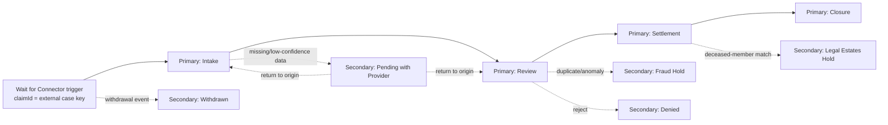

# OmniShield 360
### Adaptive Payer-Provider Lifecycle & Anti-Litigation Governance Desk

**Creator and owner:** [Aditya Panigrahy](https://www.linkedin.com/in/aditya-narayan-panigrahy/)  
**Repository:** [jagaadi/Omnishield360](https://github.com/jagaadi/Omnishield360)  
**Track:** UiPath AgentHack 2026 — Track 1: Agentic Case Management  
**Framework:** UiPath Maestro Case | Coded Agents | RPA | API Workflows | Human Actions  
**License:** Apache 2.0  

---

## 💡 Problem Statement

Healthcare payer operations lose millions annually due to **context complexity** and **compliance penalties** that rigid RPA and standard BPMN workflows cannot handle:

- Mixed-media intake (electronic forms + handwritten ambulance runsheets) breaks traditional parsers
- Multi-policy dual coverage (Coordination of Benefits) requires dynamic legal reasoning
- Automated billing engines lack guardrails — contacting deceased individuals triggers **FDCPA / TCPA class-action lawsuits** costing millions in settlements

**OmniShield 360** is a persistent UiPath Maestro Case. Maestro owns the
long-running lifecycle, stage transitions, SLAs, re-entry, and audit history;
coded agents, robots, integrations, and people perform governed tasks inside
the case.

---

## 🏗️ Architecture — Maestro Case



Maestro Case is the outer orchestration layer. The existing BPMN is retained
only as an optional **Maestro Agentic Process task** for structured review work.
It is not the claim lifecycle.

---

## 📁 Repository Structure

```
omnishield360-coded-agent/
│
├── case_workers.py                  Maestro stage-task worker entrypoints
├── main.py                          Local end-to-end compatibility/demo runner
├── pyproject.toml                   Python package config
├── uipath.json                      Orchestrator function mapping
├── .env.example                     Environment variable template
│
├── src/
│   ├── agents/
│   │   ├── compliance.py            SSDI / DMF anti-litigation shield
│   │   ├── deduplication.py         O(n) duplicate fraud detection
│   │   ├── pcp_referral.py          EHR referral verification
│   │   ├── cob_engine.py            CMS MSP + commercial COB ordering
│   │   └── pii_masker.py            In-flight HIPAA PHI tokenization
│   ├── workflows/
│   │   ├── schemas.py               Standardized input/output schema
│   │   └── routing.py               Decision routing helpers
│   ├── integrations/
│   │   ├── ehr_client.py            EHR / core sync wrappers
│   │   ├── notifications.py         Notification dispatch helpers
│   │   └── audit_client.py          Audit logging helpers
│   ├── bots/
│   │   ├── ui_helpers.py            Bot-friendly UI utility helpers
│   │   └── retry_utils.py           Retry handling utilities
│   └── testing/
│       ├── test-fixtures.json       7 deterministic scenario payloads
│       └── run_tests.py             Automated test runner
│
├── case-models/
│   ├── case-entity-schema.json      Wait-for-Connector case fields
│   └── omnishield360-case-plan.json Studio Web Case Plan build specification
│
├── docs/
│   ├── MAESTRO_CASE_BUILD_GUIDE.md  Private Preview implementation guide
│   ├── deployment.md                Deployment guide
│   ├── security.md                  Security & governance notes
│   └── runbooks.md                  Operational runbook
│
├── scripts/
│   └── validate_deployment.py       Checks deployment prerequisites
│
├── process-models/
│   ├── process-model.bpmn           Optional Agentic Process task/reference
│   └── mock.json                    Studio Web mock override definitions
│
└── .github/workflows/
    └── deploy.yml                   CI/CD: test → pack → publish to Orchestrator
```

---

## 🚀 Quick Start

```bash
# 1. Clone
git clone https://github.com/jagaadi/Omnishield360.git
cd Omnishield360

# 2. Install dependencies
pip install uv
uv venv && source .venv/bin/activate
uv pip install -e .

# 3. Copy environment template
cp .env.example .env

# 4. Run all 7 test scenarios plus Maestro Case contract tests
python -m unittest discover -s src/testing -p "test_*.py"
python src/testing/run_tests.py

# 5. Validate deployment prerequisites
python scripts/validate_deployment.py

# Optional: strict check for cloud deployment secrets
python scripts/validate_deployment.py --strict

# 6. Run the full batch deployment helper (Windows)
scripts\run_uipath_pipeline.bat

# 7. Run the deployment starter (recommended for a first deployment)
scripts\\start_deployment.bat

# 8. Run locally — pick a scenario by ID
python main.py --scenario SCENARIO_03_COMPLIANCE_DECEASED_LITIGATION_SHIELD
```

---

## 🎭 7 Testable Scenarios

| # | ID | Expected Status | Risk |
|---|---|---|---|
| 1 | HAPPY_PATH_ELECTRONIC | `APPROVED_FOR_INTEGRATION` | LOW |
| 2 | HANDWRITTEN_LOW_CONFIDENCE | `SUSPENDED_DATA_REMEDIATION` | MEDIUM |
| 3 | **DECEASED_LITIGATION_SHIELD** | `HALTED_COMPLIANCE_BREACH` | **CRITICAL** |
| 4 | DUAL_COVERAGE_COB_BREAK | `SUSPENDED_DUAL_COVERAGE` | MEDIUM |
| 5 | DUPLICATE_CLAIM_FRAUD | `SUSPENDED_DUPLICATE_CLAIM` | HIGH |
| 6 | MEDICAL_NECESSITY_REVIEW | `SUSPENDED_MEDICAL_NECESSITY` | MEDIUM |
| 7 | TRIPLE_COVERAGE | `SUSPENDED_DUAL_COVERAGE` | MEDIUM |

---

## ☁️ Deploying to UiPath Orchestrator

Use this exact flow for a real deployment:

```bash
# 1. Create your real environment file
cp .env.example .env

# 2. Fill in the UiPath credentials in .env
#    (client ID, client secret, tenant name, folder name, user key)

# 3. Validate the setup
python scripts/validate_deployment.py --strict

# 4. Authenticate to UiPath
uip login

# 5. Package the project
uipath pack

# 6. Publish to your tenant feed
uipath publish
```

After publishing the coded workers:
1. Open **Studio Web → Case Management Project**
2. Build the Case Plan from `case-models/omnishield360-case-plan.json`
3. Configure the Wait for Connector trigger and map `claimId` as the case key
4. Attach the functions from `uipath.json` to their case tasks
5. Configure Action apps, SLAs, re-entry, and secondary stages
6. Publish, deploy, activate, and demonstrate the case in Case App

All `print()` output streams to **Monitoring → Jobs → View Logs**.

See [the Maestro Case build guide](docs/MAESTRO_CASE_BUILD_GUIDE.md),
[DEVELOPER_SETUP.md](DEVELOPER_SETUP.md), and
[docs/deployment.md](docs/deployment.md) for full details.

---

## 🤖 UiPath for Coding Agents — Bonus Points

This solution was developed code-first using **Claude Code** via the UiPath CLI skills infrastructure:

```bash
uip skills install --agents claude
uipath codedagent init --template python
```

AI assistance was used to design the O(n) SHA-256 deduplication algorithm, the regex-based PII tokenization engine, the plan-aware COB logic, the SSDI/Death Master File circuit-breaker architecture, and the Agent-as-Judge contradiction layer.

---

## 📜 License

```
Copyright 2026 Aditya Panigrahy

Licensed under the Apache License, Version 2.0
http://www.apache.org/licenses/LICENSE-2.0
```

Project links:

- [GitHub repository](https://github.com/jagaadi/Omnishield360)
- [Issues and feature requests](https://github.com/jagaadi/Omnishield360/issues)
- [Aditya Panigrahy on LinkedIn](https://www.linkedin.com/in/aditya-narayan-panigrahy/)
- [Apache License 2.0](https://www.apache.org/licenses/LICENSE-2.0)

---

## 2026 Hardening and Agentic Improvements

The current implementation adds production-oriented controls around the
Maestro Case claim lifecycle:

- Collision-safe PHI restoration using final-text token positions.
- Structured schema rejection for incomplete or unsafe claim payloads.
- Medical-necessity LLM retry, bounded in-memory caching, and deterministic
  human-review fallback.
- Claim-scoped billing circuit breakers plus a time-bounded global halt and
  Legal Estates Action Center task.
- Agent-as-Judge consistency review before final approval.
- Deterministic streaming OCR confidence events for live job visibility.
- Multi-plan COB ordering with CMS Medicare Secondary Payer precedence,
  commercial birthday ordering, and full payer-order outputs.
- OpenTelemetry spans with UiPath structured-log fallback.
- Cross-platform CI on Windows and Linux, strict mypy checks, regression tests,
  and a Makefile-based developer workflow.

Developer checks:

```bash
make install
make check
```

On Windows without `make`, run the equivalent commands:

```powershell
python -m unittest discover -s src/testing -p "test_*.py"
python src/testing/run_tests.py
python -m mypy
python scripts/validate_deployment.py
python -m compileall -q main.py src scripts
```
